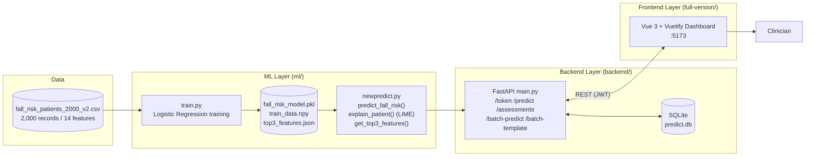

# Elderly Fall Risk Analysis — Explainable Fall-Risk Prediction System

An end-to-end clinical decision-support system that predicts elderly patients' fall risk (**LOW / MEDIUM / HIGH**) and explains every prediction with **LIME**, served through a **FastAPI** backend and a **Vue 3 + Vuetify** clinician dashboard.

## Project Overview

| Item           | Description                                                                   |
| -------------- | ----------------------------------------------------------------------------- |
| Problem        | Predict fall-risk level for elderly patients from clinical features           |
| Model          | Logistic Regression (`class_weight='balanced'`, `random_state=42`)            |
| Explainability | LIME local explanations + global Top-3 risk factors                           |
| Backend        | FastAPI (JWT auth, single & batch prediction, assessment history, PDF export) |
| Frontend       | Vue 3 + Vuetify dashboard (patient input, results, batch import)              |
| Dataset        | `data/fall_risk_patients_2000_v2.csv` — 2,000 patient records, 14 features    |

## System Architecture



## Features

- **Single prediction** — enter patient vitals, get instant LOW / MEDIUM / HIGH risk level
- **LIME explanation** — every prediction comes with per-feature contribution weights and direction
- **Top-3 risk factors** — globally most influential features surfaced to clinicians
- **Batch import** — download an xlsx template, fill in patients, upload for bulk prediction
- **Assessment history** — browse, search, and delete past assessments (SQLite persistence)
- **PDF report export** — download any assessment as a clinician-friendly PDF
- **JWT authentication** — OAuth2 password flow, token-based access

## Tech Stack

| Layer    | Technology                                                                  |
| -------- | --------------------------------------------------------------------------- |
| ML       | Python, scikit-learn, LIME, NumPy, pandas, joblib                           |
| Backend  | FastAPI, Uvicorn, SQLAlchemy (async) + SQLite (aiosqlite), PyJWT, ReportLab |
| Frontend | Vue 3, Vuetify 3, Vite, TypeScript, pnpm                                    |
| Deploy   | One-click launchers for macOS (`.command`) and Windows (`.bat`)             |

## Project Structure

```
├── data/                  # Dataset (2,000 records) + batch import template
├── ml/                    # Training script, prediction + LIME functions, model artifacts
│   └── experiments/       # Model experiments (k-fold, SHAP, class balance analysis)
├── backend/               # FastAPI application (auth, prediction, assessments, PDF)
├── full-version/          # Vue 3 + Vuetify dashboard
├── saved/                 # Label encoder, final model, feature list, threshold
├── deploy/                # One-click setup & run scripts + ML handover notes
├── docs/                  # Architecture diagram (PNG)
└── requirements.txt       # Python dependencies
```

## Getting Started

### Prerequisites

- **Python 3.10+**
- **Node.js 18+** with **pnpm** (enable via `corepack enable`, or the launcher installs it locally)

### Quick Start (one-click)

**macOS:** double-click `deploy/setup_and_run.command` (or `bash deploy/setup_and_run.command`)  
**Windows:** double-click `deploy/setup_and_run.bat`

The launcher creates a virtual environment, installs dependencies, starts both servers, waits for health checks, and opens the dashboard.

### Manual Setup

**1. Backend (port 8000)**

```bash
python -m venv .venv
	source .venv/bin/activate        # Windows: .venv\Scripts\activate
pip install -r requirements.txt
python -m uvicorn backend.main:app --host 127.0.0.1 --port 8000 --reload
```

- API: <http://127.0.0.1:8000>
- Interactive API docs (Swagger): <http://127.0.0.1:8000/docs>
- SQLite database is created automatically at `backend/predict.db`

**2. Frontend (port 5173)**

```bash
cd full-version
cp .env.example .env
# Add to .env:
#   VITE_API_BASE_URL=http://127.0.0.1:8000
pnpm install
pnpm dev
```

- Dashboard: <http://127.0.0.1:5173>

**3. Log in**

| Username          | Password      | Note                                             |
| ----------------- | ------------- | ------------------------------------------------ |
| `admin_clinician` | `password123` | Demo default — change before any real deployment |

## API Endpoints

| Method | Path                        | Purpose                                                |
| ------ | --------------------------- | ------------------------------------------------------ |
| POST   | `/token`                    | Login, obtain JWT access token                         |
| POST   | `/predict`                  | Predict fall risk for one patient (+ LIME explanation) |
| GET    | `/assessments`              | List assessment history                                |
| GET    | `/assessments/summary`      | Aggregate summary statistics                           |
| GET    | `/assessments/{id}`         | Get a single assessment                                |
| GET    | `/assessments/{id}/pdf`     | Download assessment as PDF                             |
| DELETE | `/assessments/{id}`         | Delete one assessment                                  |
| POST   | `/assessments/batch-delete` | Delete multiple assessments                            |
| DELETE | `/assessments/all`          | Clear all assessments                                  |
| GET    | `/batch-template`           | Download xlsx import template                          |
| POST   | `/batch-predict`            | Upload filled xlsx for batch prediction                |

Full request/response schemas are available in the auto-generated Swagger UI at `http://127.0.0.1:8000/docs`.

## Machine Learning Model

**Logistic Regression** — `max_iter=20000`, `class_weight='balanced'`, `random_state=42`, 20% stratified hold-out for evaluation (final model trained on full data). Test accuracy: **~84%**.

### Input Features (14)

| Feature                       | Description                       |
| ----------------------------- | --------------------------------- |
| `sex`                         | Patient sex                       |
| `age`                         | Age (years)                       |
| `night_bed_exits`             | Bed exits during the night        |
| `night_activity_duration_min` | Night activity duration (minutes) |
| `past_falls`                  | Number of past falls              |
| `mobility_score`              | Mobility score                    |
| `high_risk_medication`        | Uses high-risk medication (0/1)   |
| `cognitive_impairment`        | Cognitive impairment level (0–2)  |
| `polypharmacy_count`          | Number of concurrent medications  |
| `orthostatic_hypotension`     | Orthostatic hypotension (0/1)     |
| `tug_seconds`                 | Timed Up-and-Go test (seconds)    |
| `days_since_last_fall`        | Days since last fall              |
| `syncopal_fall`               | Syncopal (fainting) fall (0/1)    |
| `fall_cluster_30d`            | Falls clustered within 30 days    |

### Top-3 Risk Factors (by LIME, global)

| Rank | Feature                | Meaning                          | Avg LIME weight |
| ---- | ---------------------- | -------------------------------- | --------------- |
| 1    | `high_risk_medication` | Uses high-risk medication (0/1)  | 0.2256          |
| 2    | `cognitive_impairment` | Cognitive impairment level (0–2) | 0.177           |
| 3    | `past_falls`           | Number of past falls             | 0.1731          |

### Retraining

```bash
python ml/train.py
```

Regenerates `ml/fall_risk_model.pkl`, `ml/train_data.npy` (LIME training matrix), and `ml/top3_features.json`.

## Documentation Deliverables

- System architecture & data flow: `docs/architecture.png` (also rendered above)
- Environment setup & run instructions: this README + `deploy/README.md` (ML handover notes)
- API endpoint & schema docs: Swagger UI at `/docs`
- Demo video (15 min, end-to-end user flow): see accompanying submission
