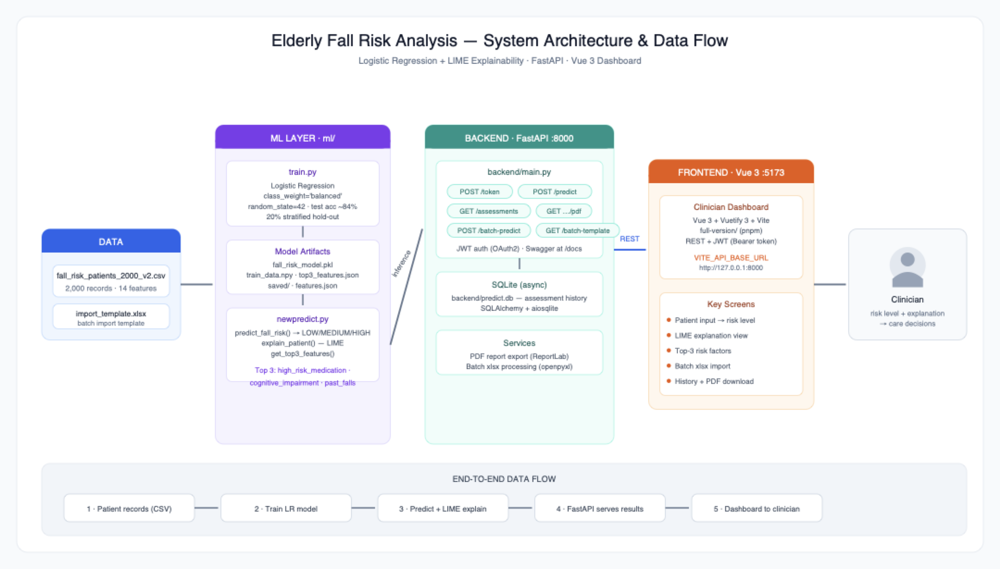

# Elderly Fall Risk Analysis — Project Documentation

**Explainable Fall-Risk Prediction System for Elderly Care**
Logistic Regression + LIME Explainability · FastAPI Backend · Vue 3 Clinician Dashboard

| Item | Detail |
|---|---|
| Project | Elderly Fall Risk Analysis (final submission) |
| Submission date | 30 August 2026 |
| Source code | GitHub repository (see Appendix C) |
| Deployment type | Local deployment (no cloud services, no external databases) |
| Demo video | 15-minute end-to-end workflow recording (submitted separately) |

---

## 1. Project Overview

Falls are the leading cause of injury among elderly residents in care facilities. This project delivers an end-to-end **clinical decision-support system** that predicts a resident's fall-risk level — **LOW / MEDIUM / HIGH** — from 14 clinical features, and **explains every prediction** so clinicians can act on it.

Key capabilities:

- **Single prediction** — enter patient vitals in the dashboard, get an instant risk level
- **Explainability** — every prediction includes per-feature contribution weights (LIME-based attribution) plus the global Top-3 risk factors
- **Actionable suggestions** — for HIGH-risk patients, the system lists minimal, modifiable changes (e.g. medication review) while filtering out non-modifiable factors (age, sex, past falls, cognitive impairment)
- **Batch import** — download an xlsx template, fill in multiple residents, upload for bulk prediction
- **Assessment history** — browse, search, and delete past assessments (SQLite persistence)
- **PDF report export** — download any assessment as a clinician-friendly PDF
- **JWT authentication** — OAuth2 password flow protects all endpoints

---

## 2. Project Background & Objectives

### 2.1 The problem, in numbers (global data)

Falls among older adults are a **growing global crisis**, not a niche issue:

| Statistic | Value | Source |
|---|---|---|
| New falls globally in 2021 (65+) | **45.7M** | GBD 2021 (npj Aging, 2025) |
| Older adults who died from falls in 2024 (US) | **43,020** | National Safety Council Injury Facts |
| Fall death rate increase 2018 → 2024 (US) | **+21%** | CDC Older Adult Falls Data |

> **Falls are the leading cause of injury death in adults 65+, and the rate is rising every year.** This is the core motivation: an early-warning system that catches high-risk residents before they fall can directly reduce injuries, hospitalisations and deaths.

### 2.2 The three project goals

| Goal | Name | Meaning |
|---|---|---|
| Predicting Risk | "Early Warning" | Establish a highly accurate and proactive early-warning system for care homes |
| Explaining Why | "Interpretable" | Transition from standard black-box models to fully explainable AI logic |
| Minimal Action | "Fair & Efficient" | Target minimal, highly precise interventions instead of sweeping protocols |

These three goals map directly to the system's three headline features: **prediction** (risk level), **explainability** (LIME attribution + Top-3 risk factors), and **actionable suggestions** (counterfactual minimal changes).

### 2.3 Stakeholders & their needs

| Stakeholder | Need |
|---|---|
| **The family of the elderly** | Early warnings without taking the elderly to hospital unnecessarily |
| **Care home nurses** | Quick risk alerts · know WHO needs attention |
| **Clinicians** | Actionable, patient-specific intervention advice; trust in *why* a prediction is made |

### 2.4 Clinical grounding of the key features

- **TUG seconds** — Schoene et al. (2013), *J Am Geriatr Soc*, 61(2), 202–208 (https://pubmed.ncbi.nlm.nih.gov/23350947/)
- **TUG distribution** — Bohannon (2006), *J Geriatr Phys Ther*, 29(2), 64–68 (https://pubmed.ncbi.nlm.nih.gov/16914068/)
- **Care-plan guidance** — CDC STEADI Coordinated Care Plan (https://www.cdc.gov/steadi/pdf/Steadi-Coordinated-Care-Plan.pdf, p.17)

---

## 3. System Architecture & Data Flow



### 3.1 Architecture Layers

| Layer | Location | Technology | Responsibility |
|---|---|---|---|
| Data | `data/` | CSV / xlsx | 2,000 patient records, 14 model features + label; batch-import template |
| ML | `ml/` | scikit-learn, LIME, NumPy, joblib | Training (`train.py`), inference + explanation (`newpredict.py`), model artifacts |
| Backend | `backend/` | FastAPI, SQLAlchemy (async) + SQLite, PyJWT, ReportLab | REST API (port 8000), JWT auth, assessment history, PDF export |
| Frontend | `full-version/` | Vue 3 + Vuetify 3 + Vite + TypeScript (pnpm) | Clinician dashboard (port 5173) |
| Deploy | `deploy/`, `full-version/docker-compose.*` | Shell launchers, Docker, nginx | One-click local run; optional containerised dev/prod |

### 3.2 End-to-End Data Flow

1. **Training (offline)** — `ml/train.py` reads `data/fall_risk_patients_2000_v2.csv`, encodes the 14 features, trains Logistic Regression (`class_weight='balanced'`), and saves `ml/fall_risk_model.pkl`, `ml/train_data.npy` (LIME training matrix) and `ml/top3_features.json`. The production model artifacts (`saved/final_model.pkl`, `label_encoder.pkl`, `features.json`, `threshold.json`) were produced by `ml/experiments/final_model.py` with the validated 70/20/10 split + threshold-tuning methodology (Sections 8–9).
2. **Inference (online)** — `ml/newpredict.py` loads the saved artifacts once at startup and exposes `predict_fall_risk()` (risk level via tuned probability threshold), `explain_patient()` (per-feature contribution weights) and `get_minimal_change()` (counterfactual suggestions on modifiable features only).
3. **API** — `backend/main.py` wraps the inference engine in a FastAPI app: JWT-protected endpoints for single/batch prediction, assessment CRUD, summary statistics, and PDF report generation (ReportLab). Every prediction is persisted to `backend/predict.db` (async SQLite, auto-created).
4. **Frontend** — the Vue 3 dashboard calls the REST API with a Bearer token (`VITE_API_BASE_URL`), rendering the risk level, explanation view, Top-3 factors, batch import, history and PDF download.
5. **Clinician** — receives risk level + explanation → care decision.

---

## 4. Technology Stack

| Layer | Technology |
|---|---|
| Language | Python 3.10+ |
| ML | scikit-learn 1.7.2 (pinned), LIME, NumPy, pandas, joblib, XGBoost (experiment baseline) |
| Backend | FastAPI, Uvicorn, Pydantic v2, PyJWT, passlib |
| Database | SQLite via SQLAlchemy (asyncio) + aiosqlite — local file `backend/predict.db` |
| Reporting | ReportLab (PDF), openpyxl (xlsx batch import) |
| Frontend | Vue 3, Vuetify 3, Vite, TypeScript, pnpm |
| Deploy | `.command` / `.bat` launchers; Docker Compose (dev/prod) + nginx |

---

## 5. Environment Setup & Step-by-Step Run Instructions

**Prerequisites:** Python 3.10+, Node.js 18+ with pnpm (`corepack enable`, or the launcher installs it locally). No cloud account, no external database, and no API keys are required.

### Option A — One-click launch (recommended)

- **macOS:** double-click `deploy/setup_and_run.command` (or run `bash deploy/setup_and_run.command`)
- **Windows:** double-click `deploy/setup_and_run.bat`

The launcher creates a virtual environment, installs Python dependencies, starts the backend and frontend, waits for health checks, and opens the dashboard in your browser.

### Option B — Manual setup

**Step 1 — Backend (port 8000)**

```bash
git clone https://github.com/alex07121/Elderly-Fall-Risk-Analysis
cd Elderly-Fall-Risk-Analysis
python -m venv .venv
source .venv/bin/activate         # Windows: .venv\Scripts\activate
pip install -r requirements.txt
python -m uvicorn backend.main:app --host 127.0.0.1 --port 8000 --reload
```

- API base: <http://127.0.0.1:8000>
- Interactive Swagger docs: <http://127.0.0.1:8000/docs>
- SQLite database is created automatically at `backend/predict.db` on first run

**Step 2 — Frontend (port 5173)**

```bash
cd full-version
cp .env.example .env
# .env must contain:
#   VITE_API_BASE_URL=http://127.0.0.1:8000
pnpm install
pnpm dev
```

- Dashboard: <http://127.0.0.1:5173>

**Step 3 — Log in**

| Username | Password | Note |
|---|---|---|
| `admin_clinician` | `password123` | Demo default — change before any real deployment |

**Step 4 — Verify** — open the dashboard, submit a single prediction, confirm the risk level and explanation view render, then check Swagger at `/docs` responds.

### Option C — Docker

```bash
cd full-version
docker compose -f docker-compose.dev.yml up --build     # development
docker compose -f docker-compose.prod.yml up --build    # production (nginx-served)
```

Copy `.env.example` to `.env` and set `VITE_API_BASE_URL` before building the production image.

### Retraining the model (optional)

```bash
python ml/train.py
```

Regenerates `ml/fall_risk_model.pkl`, `ml/train_data.npy` (LIME matrix) and `ml/top3_features.json`.

---

## 6. API Endpoints & Schema Documentation

All endpoints except `POST /token` require the header `Authorization: Bearer <token>`. Full interactive schemas: **<http://127.0.0.1:8000/docs>** (auto-generated Swagger UI).

### 6.1 Endpoints

| Method | Path | Purpose | Request | Response |
|---|---|---|---|---|
| POST | `/token` | Login (OAuth2 password flow), returns JWT access token | form: `username`, `password` | `{ access_token, token_type }` |
| POST | `/predict` | Predict risk for one patient + explanation + suggestions | JSON: `PatientData` (6.2) | `{ id, fall_risk_level, lime_explanations[], suggestion, risk_drivers[] }` |
| GET | `/assessments` | List assessment history (paginated) | query params | array of assessment objects |
| GET | `/assessments/summary` | Aggregate risk-level statistics | — | summary counts |
| GET | `/assessments/{id}` | Get a single assessment | path: id | assessment object |
| GET | `/assessments/{id}/pdf` | Download assessment as PDF report | path: id | `application/pdf` stream |
| DELETE | `/assessments/{id}` | Delete one assessment | path: id | `{ detail }` |
| POST | `/assessments/batch-delete` | Delete multiple assessments | JSON: `{ ids[] }` | `{ detail }` |
| DELETE | `/assessments/all` | Clear all assessments | — | `{ detail }` |
| GET | `/batch-template` | Download xlsx import template | — | `application/vnd...sheet` stream |
| POST | `/batch-predict` | Upload filled xlsx/csv (≤25 MB) for batch prediction | multipart file | per-row results + summary |

### 6.2 `PatientData` request schema (14 model inputs + 1 optional)

| Field | Type | Range | Description |
|---|---|---|---|
| `sex` | string | `M` / `F` | Patient sex |
| `age` | int | 60–100 | Age (years) |
| `night_bed_exits` | int | 0–8 | Bed exits during the night |
| `night_activity_duration_min` | float | 0–120 | Night activity duration (minutes) |
| `past_falls` | int | 0–5 | Number of past falls |
| `mobility_score` | int | 1–10 | Mobility score |
| `high_risk_medication` | int | 0/1 | Uses high-risk medication |
| `cognitive_impairment` | int | 0–2 | Cognitive impairment level |
| `polypharmacy_count` | int | 0–14 | Number of concurrent medications |
| `orthostatic_hypotension` | int | 0/1 | Orthostatic hypotension |
| `tug_seconds` | float | 8.0–31.9 | Timed Up-and-Go test (seconds) |
| `days_since_last_fall` | int, optional | ≥ 0 | Blank/None = no fall recorded (model sentinel −1) |
| `syncopal_fall` | int | 0/1 | Fall with loss of consciousness |
| `fall_cluster_30d` | int | 0/1 | ≥ 2 falls within 30 days |
| `resident_id` | string, optional | — | Links repeated assessments of the same resident |

Validation is enforced by Pydantic (`ge`/`le` bounds above); out-of-range values return HTTP 422. A contradictory `past_falls = 0` with `days_since_last_fall = 0` is normalised to "not recorded".

### 6.3 `POST /predict` response example

```json
{
  "id": 42,
  "fall_risk_level": "HIGH",
  "lime_explanations": [
    { "feature": "tug_seconds", "condition": "TUG_SECONDS state baseline",
      "weight": 0.5812, "direction": "push HIGH" }
  ],
  "suggestion":  { "risk_level": "HIGH", "all_options": [
      { "feature": "high_risk_medication", "from": 1, "to": 0, "can_flip": true } ] },
  "risk_drivers": [ "...top contributing features..." ]
}
```

Suggestions (`get_minimal_change`) only propose changes to **modifiable** features; `sex`, `age`, `past_falls` and `cognitive_impairment` are treated as non-modifiable.

---

## 7. Machine Learning Pipeline

### 7.1 Dataset

`data/fall_risk_patients_2000_v2.csv` — 2,000 elderly-care resident records, 17 columns (14 model features + `patient_id` + `fall_risk_score` + label `fall_risk_level`). Class distribution is imbalanced:

```
LOW:      344  (17.2%)
MEDIUM: 1,132  (56.6%)
HIGH:     524  (26.2%)
```

This imbalance is the reason `class_weight='balanced'` is mandatory (without it, HIGH recall drops to ~87% per the team's imbalance experiments).

**Data integrity:** `fall_risk_score` is **never used as a model feature** — it is the label-generation score (target leakage). The model learns purely from the 14 clinical inputs.

**Preprocessing:** `sex` F→0/M→1; boolean flags → 0/1; `days_since_last_fall` blank → −1 sentinel ("never fell"), applied consistently in both training and inference. No scaling is required for Logistic Regression in this feature space.

### 7.2 Model selection — why Logistic Regression

The team compared **Logistic Regression vs XGBoost vs Random Forest** under the fair evaluation protocol (Section 9.2, Iteration 3). **Logistic Regression won on both feature sets and both metrics** — and it is the most interpretable model, a decisive factor for a clinical tool where every prediction must be explainable. XGBoost's accuracy advantage observed in Phase 1 did not transfer to the v2 data.

| Model | HIGH recall (17 feat) | HIGH recall (14 feat) | Accuracy (14 feat) |
|---|---|---|---|
| **Logistic Regression** | **0.9427** | **0.9447** | **0.9045** |
| XGBoost | 0.8282 | 0.8493 | 0.8795 |
| Random Forest | 0.7155 | 0.7155 | 0.8380 |

Final model: `LogisticRegression(max_iter=20000, class_weight='balanced', random_state=42)`.

### 7.3 Explainability

- **Local:** per-prediction feature-contribution weights (`explain_patient()`), ranked by absolute impact, shown with direction ("push HIGH" / "pull away") in the dashboard.
- **Global Top-3 risk factors (LIME analysis):** ① `high_risk_medication` (avg weight 0.226) ② `cognitive_impairment` (0.177) ③ `past_falls` (0.173). The coefficient-based static ranking deployed at `ml/top3_features.json` (high_risk_medication, past_falls, orthostatic_hypotension) is consistent with this ranking.
- **Counterfactual suggestions:** for HIGH-risk patients, the system tests single-unit changes on modifiable features and reports which change flips the prediction out of HIGH — giving clinicians concrete intervention options.

### 7.4 Feature balance & clinical consistency

Feature means by risk level — **every feature moves in the direction clinical literature predicts**, which is why the model's SHAP top-5 ranking stays identical across folds (Section 8.3):

| Feature | LOW | MEDIUM | HIGH | Direction |
|---|---|---|---|---|
| age | 73.6 | 78.5 | 83.5 | HIGH older ↑ |
| night_bed_exits | 1.9 | 2.1 | 2.5 | HIGH gets up more ↑ |
| past_falls | 0.3 | 0.5 | 0.8 | HIGH fell more ↑ |
| tug_seconds | 9.6 | 14.3 | 20.7 | HIGH slower TUG ↑ |
| mobility_score | 8.6 | 7.1 | 4.3 | HIGH worse mobility ↓ |
| polypharmacy_count | 3.5 | 4.4 | 5.2 | HIGH more drugs ↑ |
| days_since_last_fall | 10.0 | 14.8 | 22.3 | HIGH longer since last fall ↑ |

---

## 8. Evaluation Results

All figures below are **reproducible** by running `python ml/experiments/final_model.py` (`random_state=42` throughout). Methodology: 5-fold stratified CV for stability, then 70/20/10 train/validation/test split with probability-threshold tuning on the validation set (best threshold = 0.50), final report on the untouched test set.

### 8.1 5-Fold Cross-Validation (stability)

| Metric | Mean ± Std |
|---|---|
| Accuracy | 0.9045 ± 0.0104 |
| HIGH recall | 0.9447 ± 0.0212 |
| HIGH precision | 0.9000 ± 0.0339 |

### 8.2 Hold-out test set (n = 200, threshold = 0.50)

| Class | Precision | Recall | F1-score | Support |
|---|---|---|---|---|
| HIGH | 0.87 | **1.00** | 0.93 | 53 |
| LOW | 0.80 | 0.97 | 0.88 | 34 |
| MEDIUM | 0.99 | 0.86 | 0.92 | 113 |
| **accuracy** | | | **0.92** | 200 |
| macro avg | 0.89 | 0.94 | 0.91 | 200 |
| weighted avg | 0.93 | 0.92 | 0.92 | 200 |

**Headline results: overall test accuracy 91.5%; HIGH-risk recall 100% (53/53 caught, 0 missed).**

### 8.3 Overfitting check — triple evidence

| Evidence | Number | Meaning |
|---|---|---|
| Validation vs Test gap | acc 1.25% (0.9275 → 0.9150) · recall 0.96% (**< 3% rule**) | Model generalises to unseen data |
| 5-fold stability | 0.9045 ± 0.0104 (acc), 0.9447 ± 0.0212 (recall) | Low variance across folds |
| SHAP ranking stability | Top-5 features identical across 5 folds | Learned real patterns, not noise |

**No overfitting detected.**

### 8.4 Why HIGH recall matters clinically

For fall prevention, a missed HIGH-risk resident (false negative) is far costlier than an unnecessary intervention (false positive). The tuned threshold keeps overall accuracy ≥ 90% **while catching every HIGH-risk patient** in the test set.

---

## 9. The Engineering Journey: Phase 1 → Phase 2

*This section documents the full model-engineering process — every stage's problem, what we changed and why, and how the final system was reached. It complements Sections 7–8 with the process narrative.*

### 9.1 Phase 1 — First Working Pipeline (Problems & Solutions)

**Stage: Data Generation (Jim)**

| Item | Detail |
|---|---|
| **Problem** | No real clinical dataset was available for training. |
| **Solution** | Jim researched fall-risk literature (WHO, CDC STEADI, Morse Fall Scale, Hendrich II, Beers 2023, MMSE, TUG) and generated **2,000 synthetic patient records** with Faker + NumPy, using clinical distributions (Poisson for counts, Normal for scores). Every one of the 10 blueprint features maps to an evidence-based clinical instrument. |
| **Deliverable** | `fall_risk_patients_2000.csv` (v1) → later `fall_risk_patients_2000_v2.csv` (v2, adds `sex`, `days_since_last_fall`, `syncopal_fall`, `fall_cluster_30d`). |

**Stage: First Model (Kero) — the "shortage" we had to fix**

| Item | Detail |
|---|---|
| **Problem** | Phase 1 LR baseline: **accuracy 84%, HIGH recall 93%** — below our targets; comparison with Alex's setup was **not fair** (different splits, no shared protocol); we **could not prove no overfitting** (no validation set, no stability check). |
| **Solution** | We defined the Phase 2 promise: **≥ 90% accuracy and ≥ 95% HIGH recall**, with a fair, reproducible evaluation protocol. |
| **Key lesson** | A good metric number is not enough — the *process* (validation, fairness, overfitting proof) is what makes a result trustworthy. |

### 9.2 Phase 2 — Iterative Improvement Process (Mid-Term → Final)

#### Iteration 1 — Rigorous validation framework (Kero)

| Item | Detail |
|---|---|
| **Problem** | Single 80/20 split gives unstable estimates; no room to tune without touching the test set. |
| **Solution** | Kero consistently used the **70/20/10 train/validation/test** split (stratified) throughout — from the very first Phase 2 model — so there was always a dedicated validation set for tuning and a clean, untouched test set for final reporting. On top of that we added **5-fold Stratified K-Fold CV** for stability; tuned the probability threshold **only on the validation set**; and added a validation-vs-test **overfit check**. |
| **Result** | LR `class_weight='balanced'` + `max_iter=5000` (later 20000 in the production artifact). |

> **Note on teamwork:** while Kero developed the 70/20/10 + K-Fold + threshold pipeline, **Alex worked in parallel** on his own feature set and LIME explainability (80/20 sanity + counterfactual suggestions). The two tracks ran side by side through Iterations 1–2, which is exactly why a fair comparison protocol (Iteration 3) was needed to merge them fairly.

#### Iteration 2 — Feature engineering (Kero)

| Item | Detail |
|---|---|
| **Problem** | Linear LR could not capture interactions between clinical factors. |
| **Solution** | Added 4 engineered interaction features: `mobility_tug_ratio`, `night_falls_interaction`, `med_poly_interaction`, `age_mobility_risk`. |
| **Result** | 17-feature Kero set; 5-fold HIGH recall **0.9427** (LR beats XGB 0.8282 and RF 0.7155). |
| **Lesson** | Engineered features helped, but we later proved (Iteration 3–4 below) they were **redundant** with Alex's feature set — more features ≠ better. |

#### Iteration 3 — Fair comparison protocol (Kero + Alex)

| Item | Detail |
|---|---|
| **Problem** | Kero (17 features) and Alex (14 features) could not be compared directly: different splits, different pipelines, no shared test set. |
| **Solution** | Built `fair_compare.py` — **same 5-fold CV folds, same 70/20/10 split, same 200 test patients, same threshold 0.5, same LR model**. Only the feature set differs, so any score difference is attributable to the features. |

**Result (same test set):**

| Model | Features | Accuracy | HIGH recall | HIGH missed |
|---|---|---|---|---|
| Kero | 17 | 91.0% | 98.1% | 1 |
| **Alex** | **14** | **91.5%** | **100%** | **0** |
| Combo | 18 | 91.0% | 98.1% | 1 |

**Outcome:** Alex's 14-feature set won — and the Combo (18 = 14 + 4 engineered) was **identical to Kero**, proving **multicollinearity** (polypharmacy correlates r=0.75 with `med_poly_interaction`): the extra features are **noise, not signal**.

#### Iteration 4 — Final model = best of both (Kero + Alex)

| Item | Detail |
|---|---|
| **Problem** | Alex had the best feature set but only an 80/20 sanity check; Kero had the rigorous validation framework. |
| **Solution** | **Merge best-of-both:** Alex's 14 features + Kero's validation method (70/20/10, 5-fold, threshold tuning on validation, overfit check). Implemented in `ml/experiments/final_model.py` → production artifacts `saved/final_model.pkl`, `label_encoder.pkl`, `features.json`, `threshold.json`. |
| **Result** | **Test accuracy 91.5% · HIGH recall 100% (53/53) · gap 1.25% / 0.96% — no overfitting.** Promise kept. |

### 9.3 The thinking process — how we DISCOVERED that more features ≠ better

This is the reasoning trail that led us from "add more features to improve" to "fewer, cleaner features win". It is the single most important analytical lesson of the project, and it is why we built the fair-test protocol in the first place.

**Step A — The tempting assumption (why we engineered features at all)**

> "LR is linear and misses interactions. If I add interaction features (mobility × TUG, night exits × past falls, medication × polypharmacy, age × mobility), the model will capture more clinical nuance and perform better."

This is a reasonable ML instinct — engineered features *often* help. So we built the 4 interaction features (Iteration 2) and the 17-feature Kero set looked strong on its own: 5-fold HIGH recall 0.9427, better than the 10-feature Phase 1 baseline.

**Step B — The first crack (informal comparison was confusing)**

> "Kero 17 features: recall 0.9427. Alex 14 features: recall 0.9447. Who is actually better?"

The numbers were so close that the answer depended on which split, which threshold, which run — **the comparison itself was not trustworthy**. This was partly a consequence of our **parallel working style**: Kero and Alex each built their own full pipeline independently (Kero: 70/20/10 + 5-fold + threshold tuning; Alex: 80/20 sanity + LIME + counterfactual), so the two feature sets were never evaluated under the same protocol. Two people, two pipelines, two splits: nobody could say whether the difference was real or an artifact of the protocol. This is exactly the Phase 1 "not fair" problem resurfacing — and the reason we needed a shared, fair evaluation protocol before any feature decision.

**Step C — The insight: fairness before features**

> "Before arguing about features, we must control every other variable. Same folds, same split, same test patients, same threshold, same model — ONLY the feature set may differ."

We built `fair_compare.py` (Iteration 3, table above). Once the protocol was locked, the answer became unambiguous: **Alex's 14-feature set won on both accuracy and HIGH recall.**

**Step D — The smoking gun (combo test = controlled experiment)**

> "If the engineered features really add signal, then Alex's 14 features + the 4 engineered ones (Combo = 18) MUST beat Alex's 14. Let's run that exact experiment."

We ran the **Combo model: Alex 14 + Kero's 4 engineered features = 18 features**, under the same fair protocol. Result: **Combo = Kero exactly** (91.0% / 98.1% / 1 missed) — *adding our engineered features on top of Alex's set changed nothing, and Alex's 14 alone was still better than all 18*.

**Step E — Root-cause analysis (why the noise, not just that there is noise)**

We did not stop at "combo lost" — we investigated *why* the extra features carry no information:

- **Multicollinearity:** `polypharmacy_count` correlates **r = 0.75** with our `med_poly_interaction` feature. The interaction feature is literally built from `high_risk_medication × polypharmacy_count`, so it duplicates information already in the base set.
- **LR weight redistribution:** when we inspected coefficients, LR simply re-distributed weight between the correlated features (`high_risk_medication` 2.10 → 3.06, `med_poly_interaction` 0.34 → 0.05, new `polypharmacy_count` 0.33). **The total predictive signal is unchanged — the model can't invent information that isn't there.**
- **Constant-shift irrelevance:** changing `days_since_last_fall` handling (0 vs −1) is a constant shift that LR absorbs into the intercept — no effect on predictions.
- **Permutation-importance corroboration:** permutation tests independently flagged `polypharmacy_count` with a *negative* importance — shuffling it slightly *improved* accuracy, a classic sign of a noisy/redundant feature.

**Step F — The conclusion, stated as a principle**

> **More features ≠ better model. Features that are redundant with existing ones add noise, not signal — and the fair test is what lets us PROVE it rather than argue about it.**

This single insight drove the final decision (Iteration 4): use Alex's minimal 14-feature set, which is both the best performer *and* the most parsimonious — the ideal property for a clinical tool where every feature must be interpretable and every prediction explainable.

---

## 10. Model Evolution Dashboard (Streamlit)

To make the engineering process visible (not just the final result), Kero built a **Streamlit dashboard** (`ml/experiments/dashboard.py`) whose **Model Evolution tab walks through the exact 4-step process** of Sections 8–9 with live charts — the same story told in this report:

| Step | What the tab shows | Evidence displayed |
|---|---|---|
| **Step 1 — 3-Model Comparison** | Two side-by-side bar charts (Kero 17 features / Alex 14 features), each showing HIGH recall **and** accuracy per model | LR wins in BOTH feature sets (recall 0.9427 / 0.9447) |
| **Step 2 — Combo Attempt** | Combo (18 features) vs Alex (14) grouped bar chart | Combo is **worse** — adding engineered features on top of Alex's set misses 1 HIGH patient → multicollinearity = noise |
| **Step 3 — Fair Comparison** | Kero vs Alex on the same test set | Alex 14 wins (0 HIGH missed vs 1) |
| **Step 4 — Final Model** | Final metrics cards | 🏆 91.5% accuracy · 100% HIGH recall · 0 missed (53/53) |

*Note: the dashboard computes its charts live from its own internal evaluation runs, so intermediate figures on screen may differ slightly from the final test-set numbers in Sections 8–9; Step 4 displays the canonical final metrics.*

Other tabs support the same narrative:

- **Risk Distribution / Feature Distribution / Correlation / Age Analysis** — pure-data exploration of the 2,000 records (no model involved): class balance (LOW 17.2% / MEDIUM 56.6% / HIGH 26.2%), feature means per risk level, correlation heatmap, age × risk crosstab.
- **Summary Table** — every feature with its **unit**, min/max/mean/std, and Male/Female means (e.g. age in years, TUG in seconds, `days_since_last_fall` −1 = never fell).

The dashboard therefore serves as both a **presentation tool** (showing the process step by step) and an **EDA tool** (exploring the data the model learned from).

---

## 11. Known Limitations & Security Notes

- **Demo credentials** — the default login `admin_clinician` / `password123` is hardcoded for evaluation convenience (see `backend/main.py`). It must be changed before any real deployment.
- **SECRET_KEY** — the JWT signing key in `backend/main.py` is a placeholder value; rotate it and load from an environment variable for production use.
- **SQLite** — a local file database is used intentionally so the system runs fully offline with zero cloud dependencies; it is not suited to concurrent multi-user production loads.
- **No cloud services** are used — everything runs locally on the reviewer's machine; therefore **no cloud/database permission grants are required**.
- **No LLM APIs** are used — the system does not call OpenAI, DeepSeek, Gemini or any online LLM service; **no API keys are included** in this submission and none are needed to run it.
- **No mobile app** — the system is a web application; an APK is therefore not applicable.
- **Dataset scope** — the model is trained on synthetic/v2 research data (2,000 records) and must be re-validated on real clinical data before any production use.

---

## Appendix A — Project Structure

```
├── data/                  # Dataset (2,000 records) + batch import template
├── ml/                    # train.py, newpredict.py (inference + explanation), artifacts
│   └── experiments/       # k-fold CV, SHAP, class balance, fair_compare.py,
│                          # final_model.py (saved/ producer), dashboard.py (Model Evolution)
├── backend/               # FastAPI app: main.py, models.py, database.py
├── full-version/          # Vue 3 + Vuetify dashboard (pnpm/Vite)
├── saved/                 # final_model.pkl, label_encoder.pkl, features.json, threshold.json
├── deploy/                # One-click launchers (macOS/Windows) + ML handover notes
├── docs/                  # architecture.png, user guide
└── requirements.txt       # Python dependencies (scikit-learn==1.7.2 pinned)
```

## Appendix B — Batch Import Workflow

1. `GET /batch-template` (or dashboard button) → download `import_template.xlsx`
2. Fill one row per resident (14 feature columns; column-name aliases are auto-mapped)
3. Upload via `POST /batch-predict` (xlsx/xlsm/csv, ≤ 25 MB) → per-row risk level + summary statistics; all valid rows are persisted to history

## Appendix C — Source Code

Repository: <https://github.com/alex07121/Elderly-Fall-Risk-Analysis>

The repository contains the complete, clean, executable source code matching this document. No secrets or API keys are committed (`.env.example` ships with an empty token value).

## Appendix D — Data & Evaluation Integrity Notes

- **`fall_risk_score` is never used as a model feature** — it is the label-generation score (target leakage). The model learns purely from the 14 clinical inputs (see Section 7.1).
- **Threshold 0.50** was selected on the **validation set only**; the test set was touched exactly once, at final evaluation (see Section 8).
- All numbers in Sections 7–10 are reproducible with `random_state=42` (see `ml/experiments/`).
- The v2 CSV adds 3 clinical-background fields (`days_since_last_fall`, `syncopal_fall`, `fall_cluster_30d`); `days_since_last_fall` blank → sentinel −1 (never fell), consistent between training and inference.
